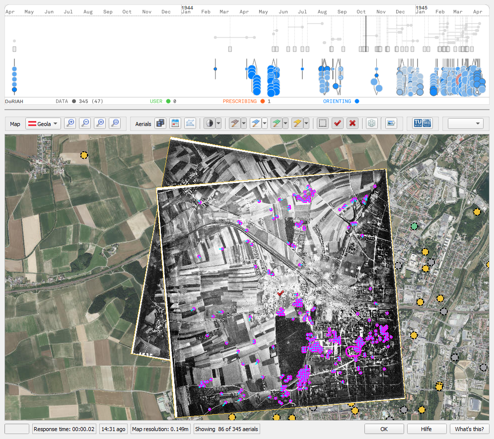

# QGIS PlugIn for the Selection and Orientation of Aerial Reconnaissance Images



Load a spread sheet with meta data of eligible aerial images, and show them minimized at the given locations on top of a web map. Double-click onto one of them to load and show its image content, and to judge its quality. If the respective image file is missing, then no image content is displayed. In that case, however, a preview image may be available. Use the context menu to find it.

Shift, rotate, and scale aerials with respect to the background map manually or automatically, in order to decide if they shall be considered for further processing. If so, mark them as *selected*, using the context menu.

For help on how to navigate the map or transform aerials, click the help button first, and then either on the map or on an aerial.

All footprints, adapted or not, are stored in an SQLite data base next to the spread sheet, together with their selection states. You can resume work at any later point by loading the same spread sheet, again.

At any point, an aerial belongs to each of these categories:

- `Availability`:
  - `missing`: no image, and no preview available.
  - `preview not yet determined`: no image available, but the preview folder for its sortie exists. However, the preview has not yet been found.
  - `preview`:  a preview is available i.e. it has been found before.
  - `image`: an image file (full resolution) is available.
- `Usage`:
  - `discarded`: the aerial has been discarded from consideration.
  - `unset`: no explicit usage has been set.
  - `selected`: the aerial shall be used in geo-referencing and image analysis. If only a preview is available, the image hence needs to be ordered.
- `Transformation modification`:
  - `original`: the aerial's transformation is the one derived from the spread sheet.
  - `changed`: the aerial's transformation has been adapted.
- `Transformation interaction`:
  - `Unlocked`: change the image orientation to your liking. Image is shown above locked ones.
  - `Locked`: the image transformation is fixed. Image is displayed below unlocked ones.

All states are indicated graphically. Use the buttons above the map view to control if aerials with the respective state shall be shown or not.

## Installation on Windows

Tested with QGIS 3.34 LTR on Windows, installed with the *standalone installer (MSI)*. Should work with newer releases.

### Optional Dependencies

#### Automated Geo-Referencing

Only works with a CUDA-capable graphics card installed.

Open the OSGeo4W shell from your start menu, and enter:

```batch
python -m pip install torch==2.2.2 torchvision==0.17.2 torchaudio==2.2.2 --index-url https://download.pytorch.org/whl/cu121
python -m pip install einops yacs kornia e2cnn pytorch-lightning opencv-python-headless
```

Extract [se2-loftr](https://github.com/WKarel/se2-loftr/archive/camera-ready.zip) into `%APPDATA%\Python\Python312\site-packages\`, and rename the folder `se2-loftr-camera-ready` to `se2_loftr`.

#### Excel 2010 files

For reading Excel 2010 xlsx/xlsm/xltx/xltm files, `openpyxl` needs to be installed. In the OSGeo4W shell, enter:

```batch
python -m pip install openpyxl
```

#### Contrast Limited, Adaptive Histogram Equalization

To make Contrast Limited, Adaptive Histogram Equalization available as image enhancement, enter in the OSGeo4W shell:

```batch
python -m pip install scikit-image
```

### The PlugIn Itself

Download the latest release of `selorecon.zip` from the [repository](https://github.com/TUW-GEO/selorecon/releases). To make the PlugIn accessible in QGIS, use menu `PlugIns` → entry `Manage and install plugins` → tab `Install from ZIP`,  choose the path to the archive just downloaded, and hit `Install Plugin`.

Make sure that the PlugIn is activated: menu `PlugIns` → entry `Manage and install plugins` → tab `Installed` → Check `SelORecon`.

You should now see the PlugIn icon in the QGIS main window. If not: menu `View` → entry `Tool boxes` → check `PlugIn tool box`.

## Configuration

By default, the PlugIn searches for full resolution images and previews in folders named `Images` and `Microfilm` next to the opened spread sheed. If your files are located elsewhere, use `Settings` → `User profiles` → `Open active profile folder`, and edit `python/plugins/selorecon/selorecon.cfg` in there accordingly.

## Acknowledgement

This software is an outcome of project [DoRIAH](https://cvl.tuwien.ac.at/project/doriah/), funded by the [FFG](https://www.ffg.at) program “IKT der Zukunft” – an initiative of the [Bundesministerium für Klimaschutz, Umwelt, Energie, Mobilität, Innovation und Technologie (BMK)](https://www.bmk.gv.at/) (Ministry for Climate Action, Environment, Energy, Mobility, Innovation and Technology), grant number 880883.